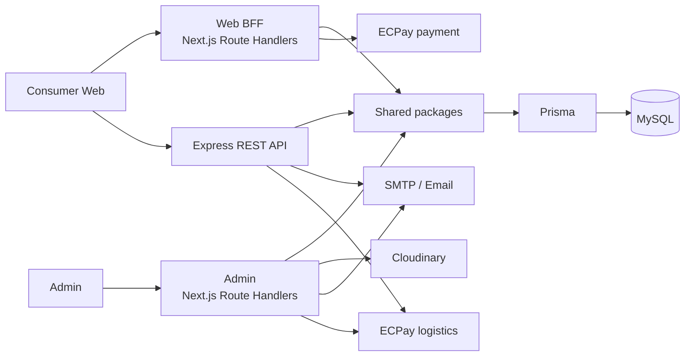

# Havoice Commerce CE

Havoice Commerce CE is a full-stack commerce and content-management monorepo built for storefront, operations, and page-composition workflows. This public portfolio edition replaces operational data and credentials with synthetic Demo data.

## Repository status

The repository contains working application routes and integration code, but it is not presented as production-ready. A public deployment, CI pipeline, comprehensive automated test suite, and end-to-end Sandbox verification are not yet available.

## Highlights

- Consumer storefront for articles, products, cart, checkout, and Member orders
- Admin operations for catalog, inventory, Orders, Customers, Users, Vendors, and Page Builder content
- Role-based access control (`RBAC`) across `SUPER_ADMIN`, `ADMIN`, `EDITOR`, `VENDOR`, and `USER`
- Express API plus application-specific Next.js Route Handlers
- Shared Prisma data layer, validation schemas, DTOs, and integration helpers
- Synthetic, repeatable Demo data for local evaluation

## Architecture



Admin operational modules primarily use same-origin Next.js Route Handlers. The Consumer Web uses the Express API for public content and selected authentication and Order flows, while its `Web BFF` handles Member profiles, Orders, and repayment. Both applications access shared packages and the Prisma data layer where required.

## Technology stack

| Area | Technology |
| --- | --- |
| Web and Admin | Next.js 14, React 18, TypeScript, Tailwind CSS 3 |
| State and forms | Zustand, React Hook Form, Zod |
| Authentication | NextAuth 4, JWT, bcryptjs |
| API | Node.js, Express 4 |
| Database | MySQL, Prisma 5 |
| Monorepo | pnpm Workspace, Turborepo 1 |
| Integrations | Cloudinary, Nodemailer, ECPay |

See each workspace's `package.json` and the lockfile for exact package versions.

## Features

### Web

- Article and product discovery, search, and detail pages
- Cart and checkout flows
- Registration, authentication, and Member account pages
- Member Order history, details, and repayment entry points
- Page Builder content loaded by `pageRoute`

### Admin

- Product, Category, inventory, publication status, and image management
- Order search, detail, status updates, manual Order creation, and shipment workflows
- Separate Customer, Member, system User, and Vendor management domains
- `RBAC` guards and Vendor data-isolation logic
- Page Builder sections, items, previews, and drag-and-drop ordering

### APIs and integrations

- Express REST API routes for authentication, articles, products, recommendations, Orders, and layouts
- NextAuth sessions and Bearer JWT authorization
- Next.js Route Handlers for Admin operations and the `Web BFF`
- Cloudinary image upload and Nodemailer Email integration code
- ECPay payment callback, repayment, and logistics integration code

Third-party features require developer-provided Sandbox credentials and environment configuration.

## Repository structure

```text
havoice-commerce-ce/
├── apps/
│   ├── web/               # Consumer Web; default port 3000
│   ├── admin/             # Admin; default port 3001
│   └── api/               # Express REST API; default port 4000
├── packages/
│   ├── database/          # Prisma schema, client, migrations, and Demo seed
│   ├── shared/            # Shared schemas, DTOs, types, and helpers
│   ├── eslint-config/     # Shared ESLint configuration
│   └── typescript-config/ # Shared TypeScript configuration
├── deploy/nas/            # NAS deployment configuration
├── pnpm-workspace.yaml
├── turbo.json
└── package.json
```

## Getting started

### Prerequisites

- Node.js 18 or later
- pnpm 8
- MySQL 8

### 1. Install dependencies

```bash
pnpm install
```

### 2. Create local environment files

Copy the examples required by the workspaces you plan to run:

```bash
cp .env.example .env
cp apps/web/.env.example apps/web/.env.local
cp apps/admin/.env.example apps/admin/.env.local
cp apps/api/.env.example apps/api/.env
cp packages/database/.env.example packages/database/.env
```

Replace all example values locally and do not commit secrets.

### 3. Prepare the Demo database

Create an empty local MySQL database and configure each required `DATABASE_URL` to use it.

Before running any Prisma schema or seed command, confirm that `DATABASE_URL` points to a disposable local Demo database—not a production, shared, or operational database.

Generate Prisma Client, initialize the schema, and seed the database:

```bash
pnpm --filter @havoice/database db:generate
pnpm --filter @havoice/database db:push
pnpm --filter @havoice/database db:seed
```

Set `DEMO_USER_PASSWORD` in the current environment before running the seed. The password must be 8–72 characters and include lowercase, uppercase, and numeric characters.

### 4. Start development services

Start all available development tasks:

```bash
pnpm dev
```

Or start workspaces individually:

```bash
pnpm --filter @havoice/web dev
pnpm --filter @havoice/admin dev
pnpm --filter @havoice/api dev
```

| Service | Local URL |
| --- | --- |
| Web | `http://localhost:3000` |
| Admin | `http://localhost:3001` |
| API | `http://localhost:4000` |

## Demo data

The seed at `packages/database/prisma/seed.ts` creates:

| Record | Count |
| --- | ---: |
| Categories | 5 |
| Products | 20 |
| Articles | 6 |
| Users | 7 |
| Customers | 12 |
| Orders | 24 |
| Page Builder sections | 12 |
| Layout items | 39 |

The seed uses deterministic UUIDs, Demo-specific slugs, Emails, SKUs, and Order numbers, then applies deterministic upserts to identify and update its own records. It does not perform a full-table delete. `DEMO_USER_PASSWORD` supplies the local Demo User password; no fixed password is documented here.

## Environment variables

| Group | Purpose |
| --- | --- |
| `DATABASE_URL` | MySQL connection used by Prisma |
| NextAuth and JWT | Session and token signing across applications |
| `DEMO_USER_PASSWORD` | Required password for seeded Demo Users |
| API, Web, and Admin URLs | Internal requests, callbacks, and redirects |
| SMTP | Order-related Email delivery |
| Cloudinary | Admin product-image uploads |
| ECPay Sandbox | Payment, callback, store selection, and logistics flows |
| CORS | Express API origin allowlist |

The root and workspace-specific `.env.example` files document the available settings. Values prefixed with `NEXT_PUBLIC_` are exposed to the browser and must not contain secrets.

## Available scripts

Run these commands from the repository root unless noted otherwise.

| Command | Purpose |
| --- | --- |
| `pnpm dev` | Run workspace development tasks through Turborepo |
| `pnpm build` | Generate Prisma Client, then run workspace build tasks |
| `pnpm lint` | Run available workspace lint tasks |
| `pnpm type-check` | Run available workspace `type-check` tasks |
| `pnpm db:generate` | Run Prisma Client generation for the database workspace |
| `pnpm db:push` | Push the Prisma schema to the configured database |
| `pnpm db:seed` | Run the synthetic Demo seed |
| `pnpm format` | Format supported files with Prettier |
| `pnpm --filter @havoice/database db:migrate` | Create or apply a development migration |
| `pnpm --filter @havoice/database db:studio` | Open Prisma Studio for the configured database |

Not every workspace defines `lint` or `type-check`; the root commands run only the tasks that exist. The root `build` and `postinstall` scripts use the unscoped `database` filter, while direct database commands above use `@havoice/database`.

## Security

- The public edition uses synthetic Demo data and excludes production credentials, real Customer and Order data, and private business records.
- Secrets are supplied through environment variables; local `.env` and `.env.local` files must remain outside version control.
- Cloudinary, SMTP, and ECPay integrations require developer-provided Sandbox credentials.
- Confirm the target `DATABASE_URL` before every Prisma schema, migration, seed, or Studio command.
- Integration code and callbacks have not been represented as production-certified or fully verified end to end.

## Current limitations

- Automated coverage is limited to an ECPay checkout test; no comprehensive unit, integration, or end-to-end suite exists.
- No repository CI configuration or public Demo deployment is included.
- Third-party Sandbox flows require credentials and further end-to-end verification.
- Root-level lint and type-check commands do not provide uniform coverage across all workspaces.
- Some historical documentation may describe earlier architecture or configuration.

## Roadmap

1. Standardize lint, type-check, and test scripts across workspaces.
2. Add automated coverage for authentication, Orders, `RBAC`, and Demo seed behavior.
3. Complete the third-party Sandbox test matrix and callback validation.
4. Add CI and a sanitized public Demo environment.
5. Publish architecture, data-model, workflow, and interface diagrams.
6. Record significant architecture decisions and reconcile historical documentation.

## Contact

- GitHub: [tigger-bai](https://github.com/tigger-bai)
- Email: [tiggerbai@gmail.com](mailto:tiggerbai@gmail.com)

## License

License pending. This repository does not currently include a `LICENSE` file.
